SELECT LANGUAGE: English, [简体中文](Readme_Chinese.md)
  
  
# HOW TO USE
There are only two blueprint nodes "UnicodeToCharacter" and "CharacterToUnicode".  
They have the same parameters, a DataTable of Stru_CharacterTable structure and a String.
They all have a String ReturnValue.
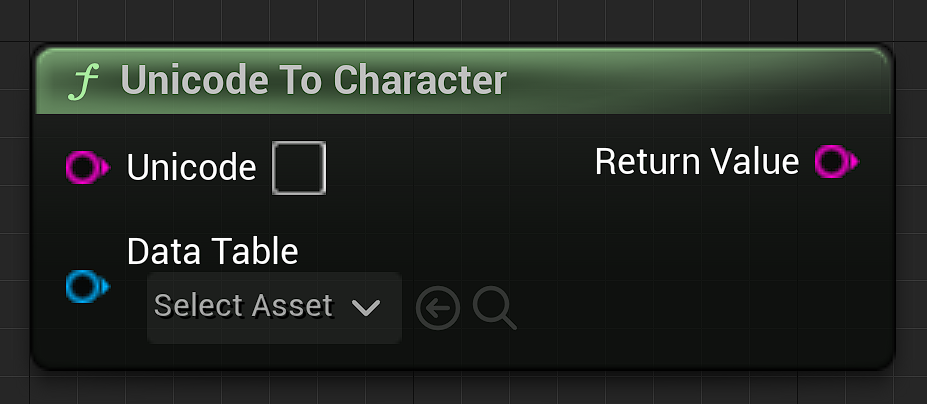  
  
  
All you have to do is input a string of Unicode or a string of special characters into the correct node, and it will return the corresponding data in the DataTable that you select. If there is a problem with your input value, it will report the error in the log and return string "NULL".
__The plug-in contains a complete ChineseCharacter data table.__  
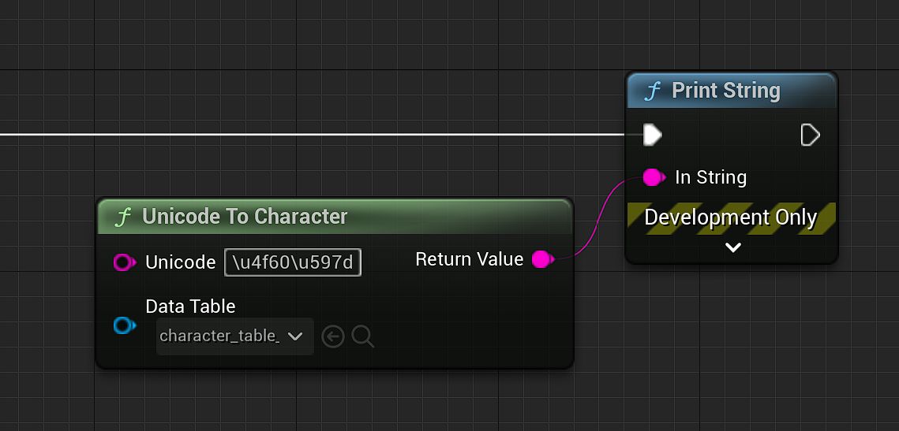  
  
  
  
  
# I wander the Structure of Stru_CharacterTable, I think it helps me understand this plugin
Stru_CharacterTable is a C++ Structure which consists of two variables of String, "Unicode" and "Character".
__You CANNOT break C++ structure in BP__  
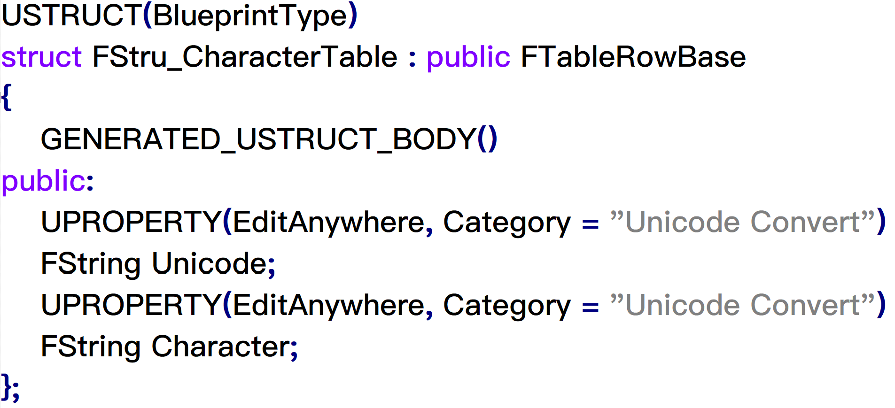  
  
  
  
  
# I need an example of DataTable 
There is a ChineseCharacter DataTable in the Content folder of the plug-in, You can use it directly or download the source file from here: [Chinese Character Table UTF-8](Resource/ChineseCharacterTable_UTF8.csv) [Chinese Character Table ANSI](Resource/ChineseCharacterTable_ANSI.csv)。  
 _Microsoft_ _Excel_ _365_ seems unable to read the CSV file with UTF-8 format. You can use Notepad++ or use ANSI version file to open it normally.  
__You need to convert your CSV file to UTF-8 format to use in UE Editor, otherwise it will be garbled.__  
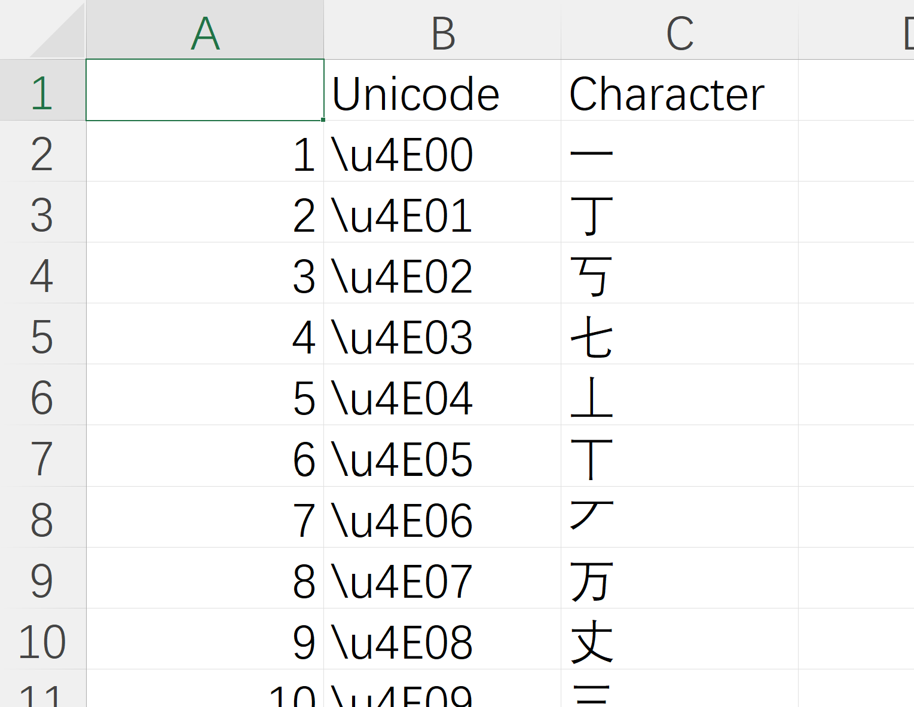  
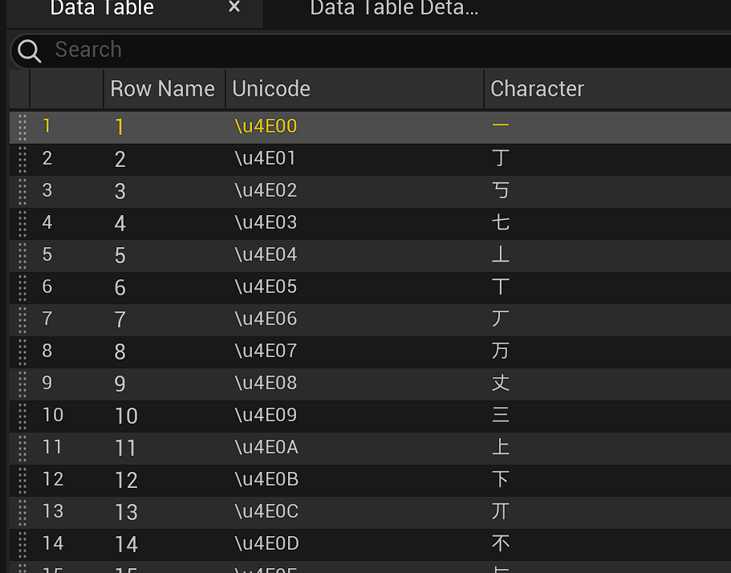  
  
  
  
  
# How to make a suitable DataTable
.  
## 1.We need a character comparison table in TXT format. This table should look like this. It has Unicode codes and corresponding characters.
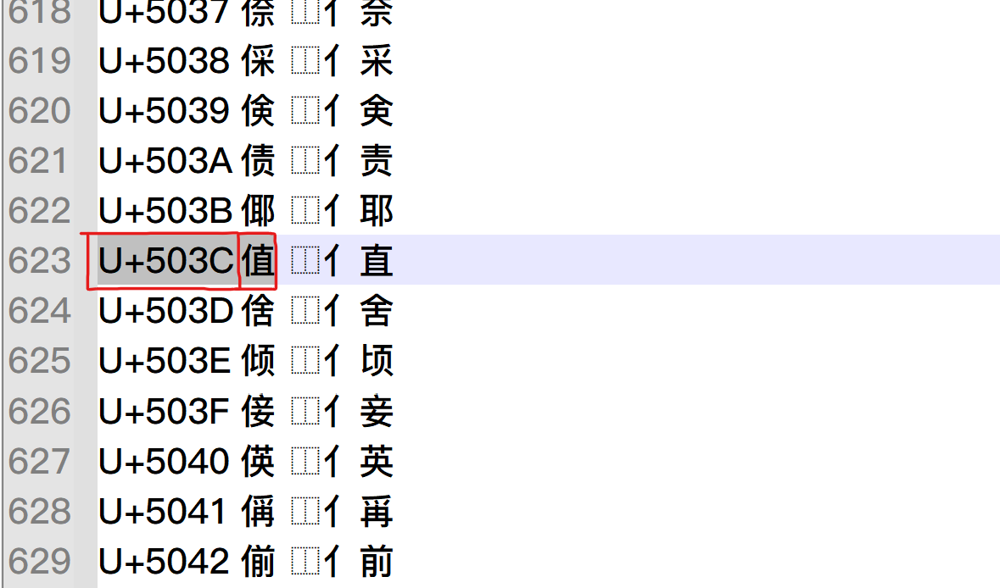  
  
## 2.In general, a Unicode table have many languages. We only need to intercept the parts we need. As shown in the figure, the basic Chinese Character range is \u4E00~\u9FA5.  
__The data in the picture is the range of Chinese Character, You may need to find your own language range__  
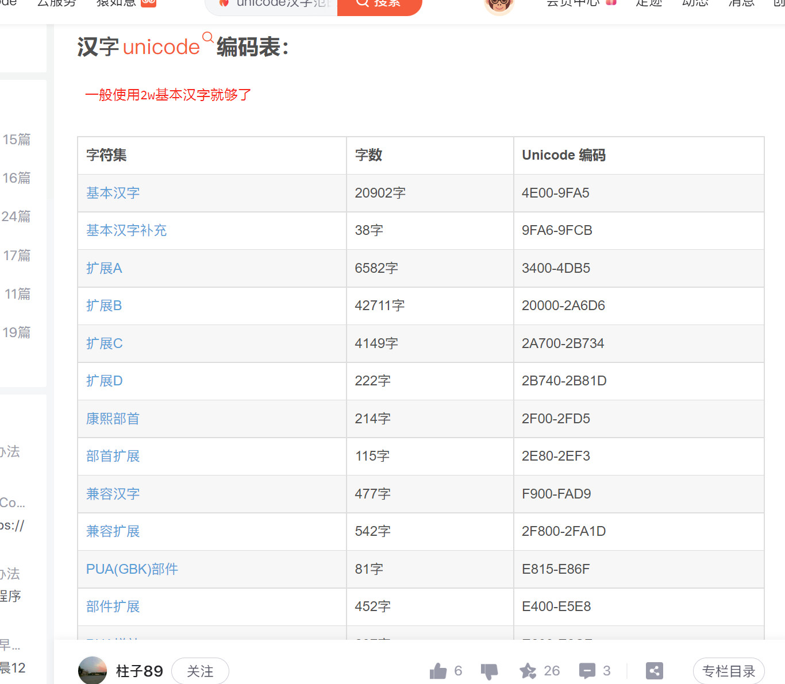  
  
## 3.Use MS Excel or other software to process the character comparison table into the following figure.  
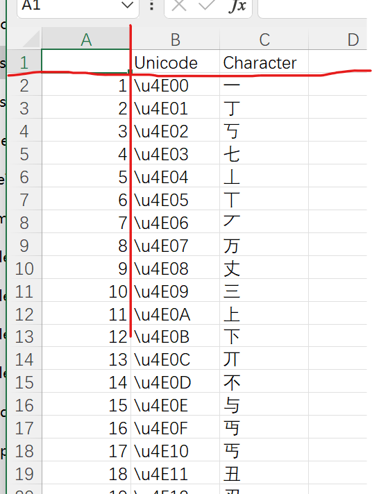  
  
## 4.Export to CSV format. (The software in the picture is Microsoft Excel)  
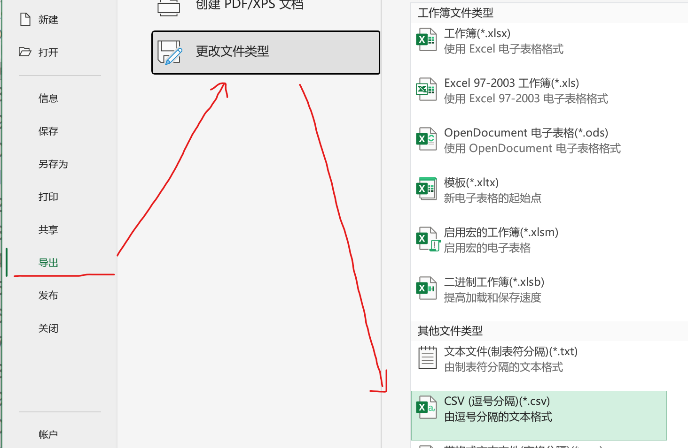  
  
## 5.Use Notepad++ or Windows Notepad to convert it from ANSI format to UTF-8 format. (it will be garbled in the editor if you dont do this)  
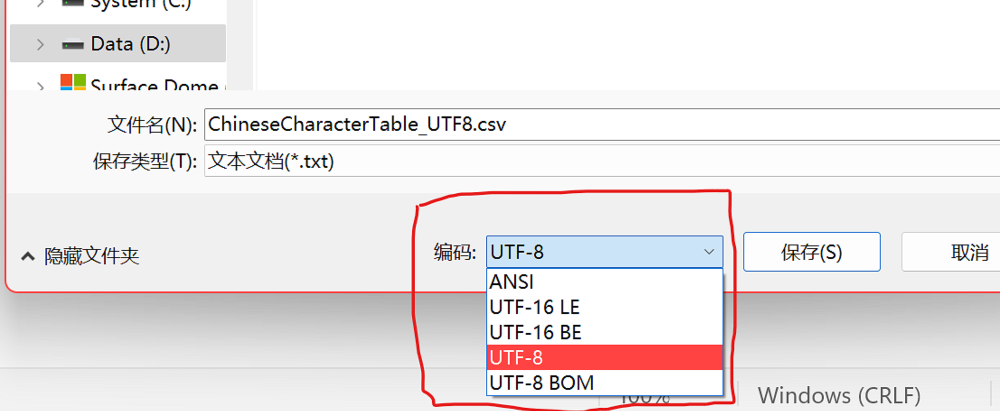  
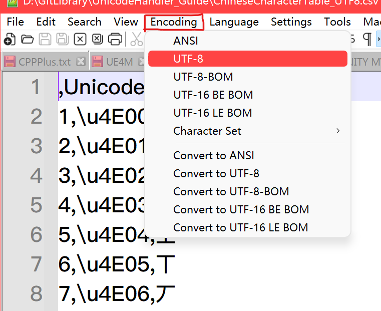  
  
## 6.Import it into UE Editor and select Stru_CharacterTable structure.  
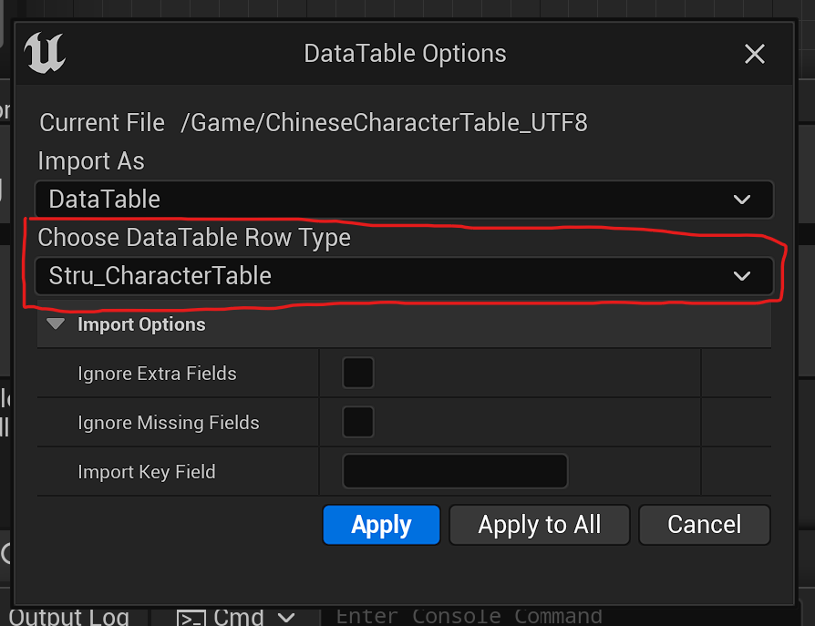  
  
## 7.Then you can use your new table.  
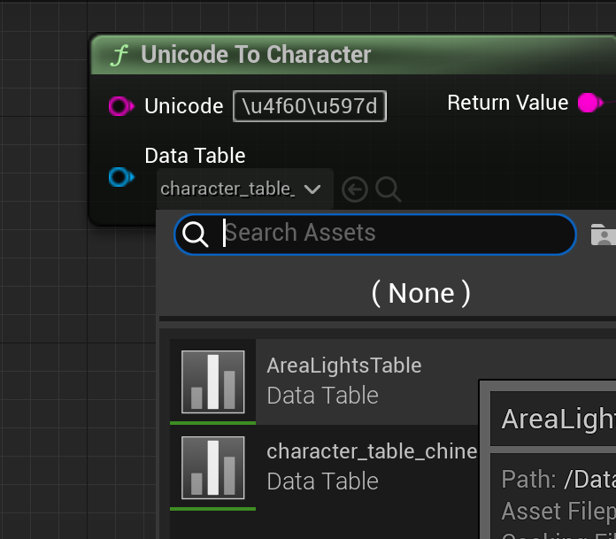  