#HOW TO USE
只有两个蓝图节点：“UnicodeToCharacter”和“CharacterToUnicode”。
它们有相同的参数，分别是Stru_CharacterTable类型的DataTable和String。
它们有相同的输出，只有一个String类型的ReturnValue。
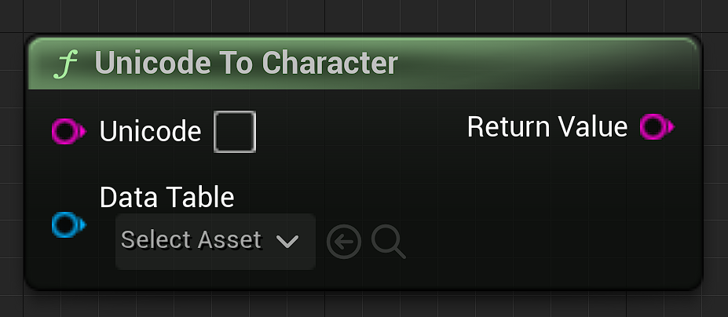
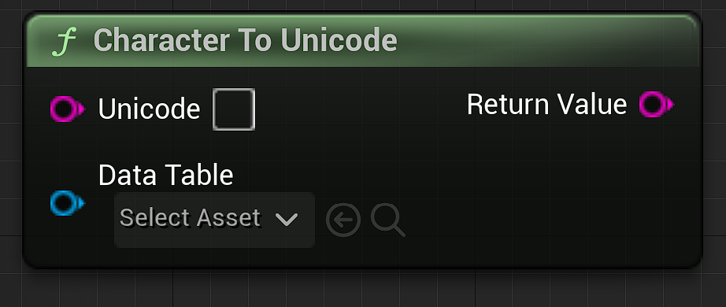

你所要做的就是把一串unicode或是一串特殊的character输入进正确的节点中，它就会返回DataTable表中所对应的数据。插件中包含一张完整可用的ChineseCharacter数据表。
如果你的输入值有问题，它会将错误汇报在Log中并返回String "NULL"。
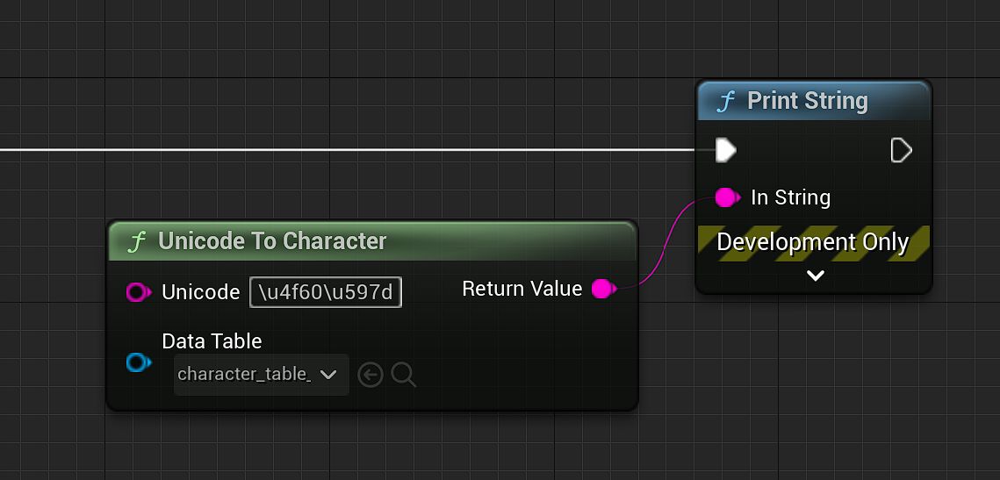

##我想要知道 Stru_CharacterTable 的结构
Stru_CharacterTable 是一个C++ Struct，它由两个String类型的变量构成，它们的名称分别是“Unicode”和“Character”。
C++ Struct 没办法在蓝图中Break
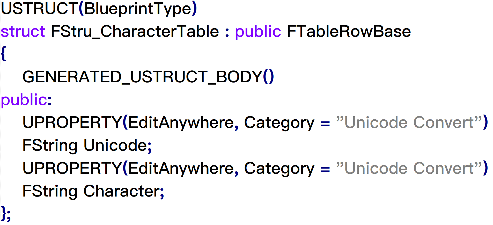

##我需要一个 DataTable 例子
插件中的Content文件夹内有一个已经制作好的Chinese Character DataTable，你可以直接使用它，或是在这里下载源文件：[Chinese Character Table UTF-8](ChineseCharacterTable_UTF8.csv) [Chinese Character Table ANSI](ChineseCharacterTable_ANSI.csv)。
另外一提，这个csv文件是UTF-8格式的，但 Microsoft Excel 365 似乎无法正确阅读UTF-8格式的csv文件，你可以使用 Notepad++ 将其正常打开。
你需要将你的csv文件转换为UTF-8格式才能在Editor中使用，否则它将会乱码。
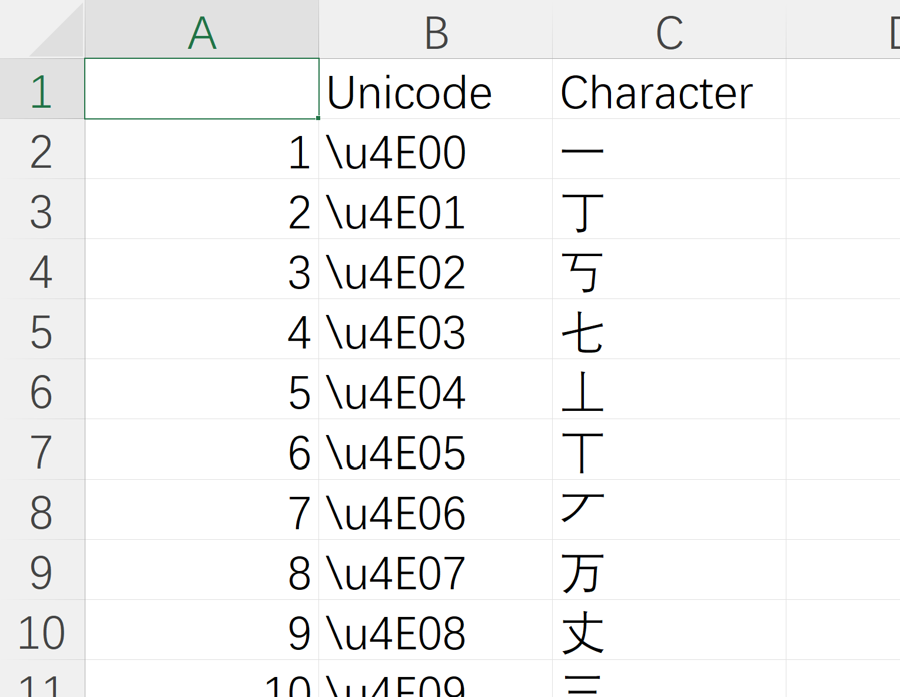
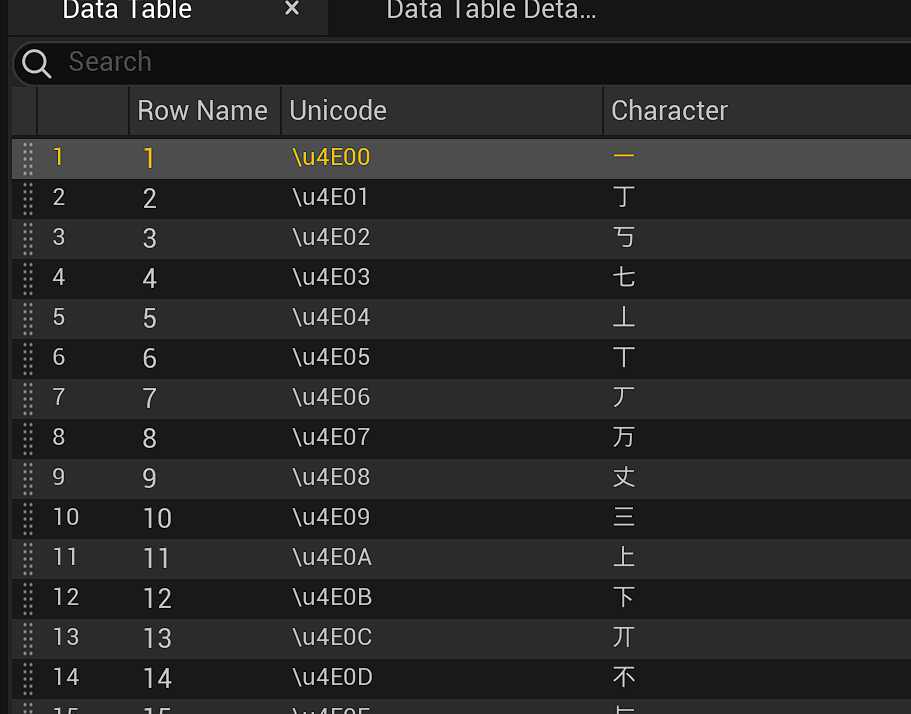

#HOW TO MAKE A SUITABLE DataTable
1.我们需要一个txt格式的字符对照表，这个表应该是这个样子，它有Unicode代码和代码对应的字符。
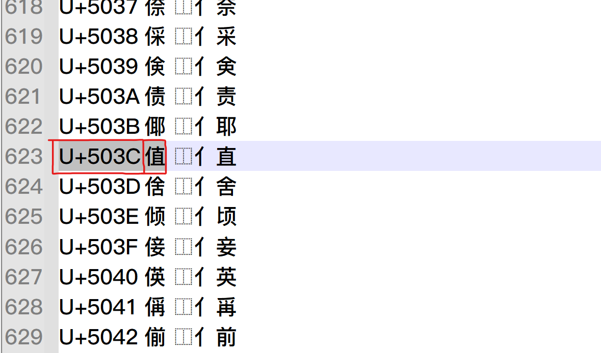

2.通常情况下，一个Unicode编码表拥有很多种语言，我们只需要截取我们需要的部分即可。如图所示，基础Chinese Character的范围是 \u4E00~、u9FA5。（插件中ChineseCharacterTable的范围：\u4E00~\u9FA5，包括常用标点符号）
 The data in the picture is Chinese Character 
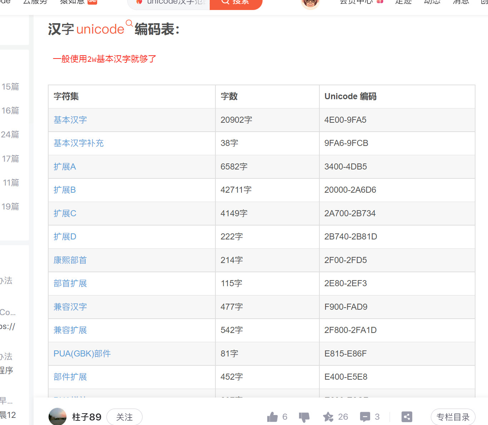

3.使用Excel或其他软件将原生TXT格式的字符对照表处理成下图所示。
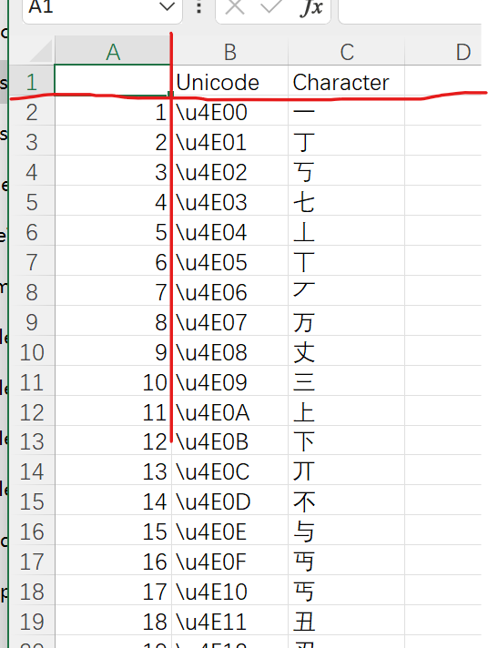

4.导出CSV格式。（The software in the picture is Microsoft Excel）
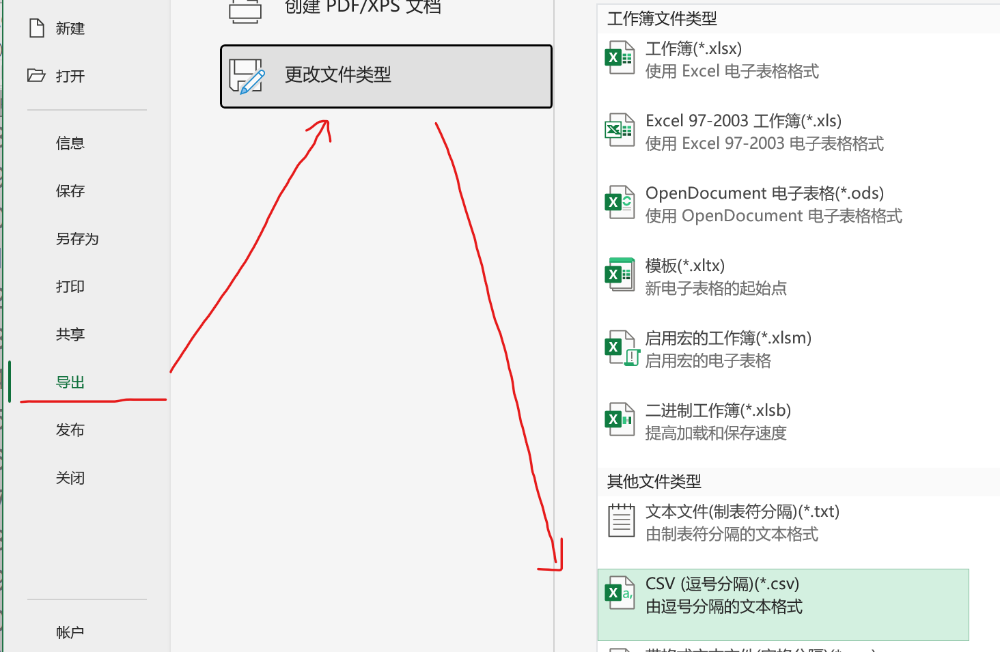

5.使用 Notepad++ 或 Windows Notepad 将它从ANSI格式转换为UTF-8格式。（如果不这样做，它会在Editor中乱码）
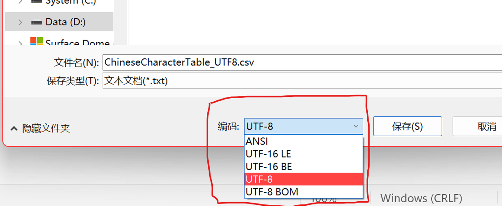
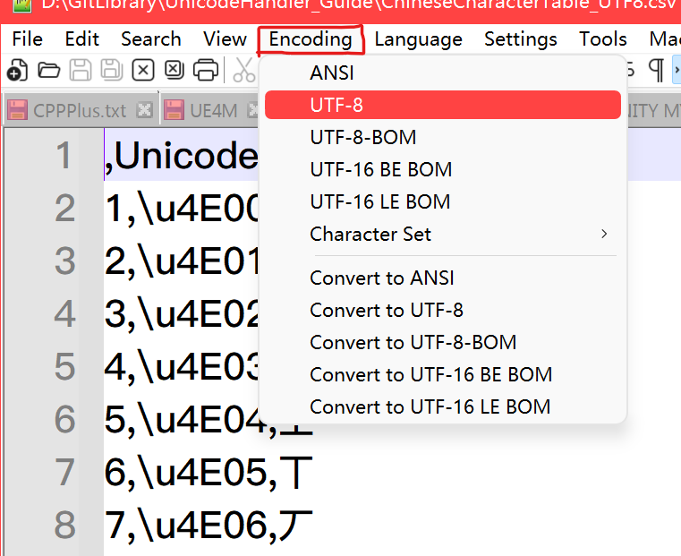

6.将其导入至Editor并选择Stru_CharacterTable格式。
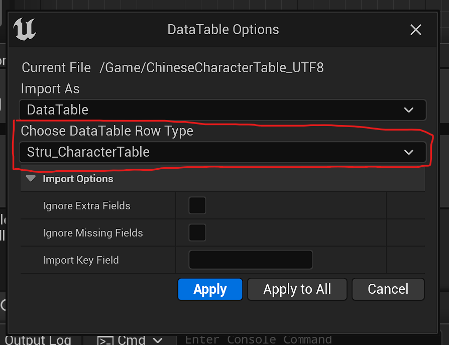

7.然后你就可以使用你的新表了。
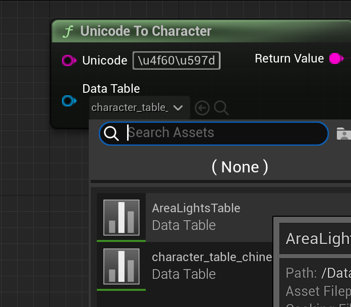